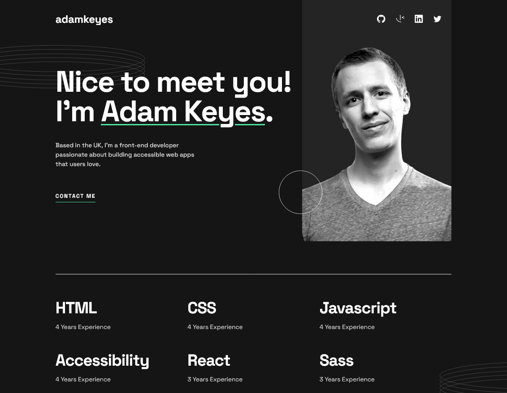
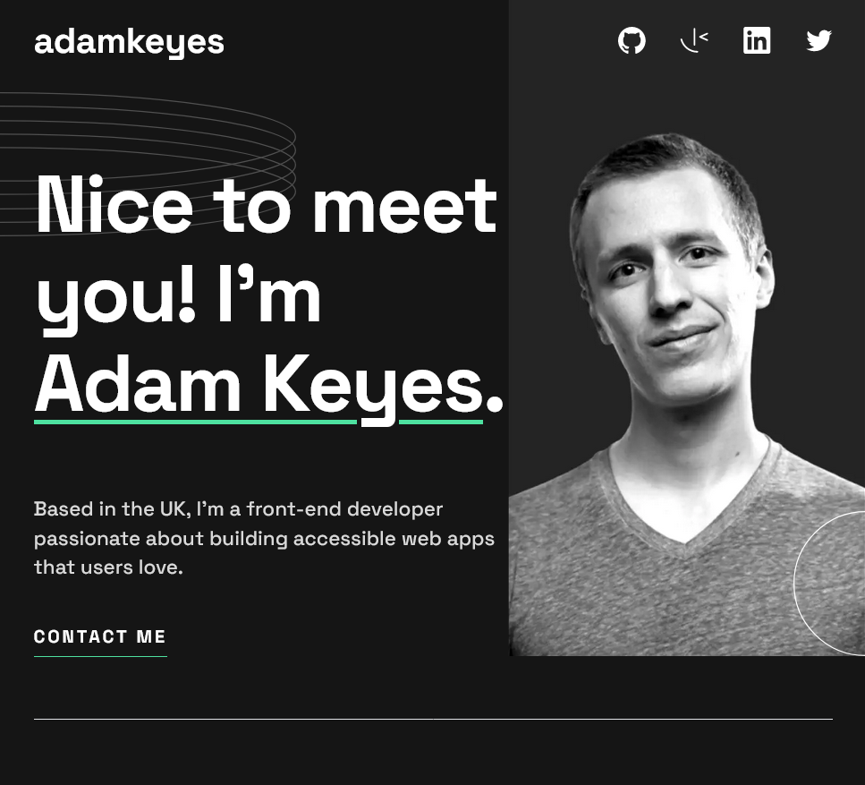
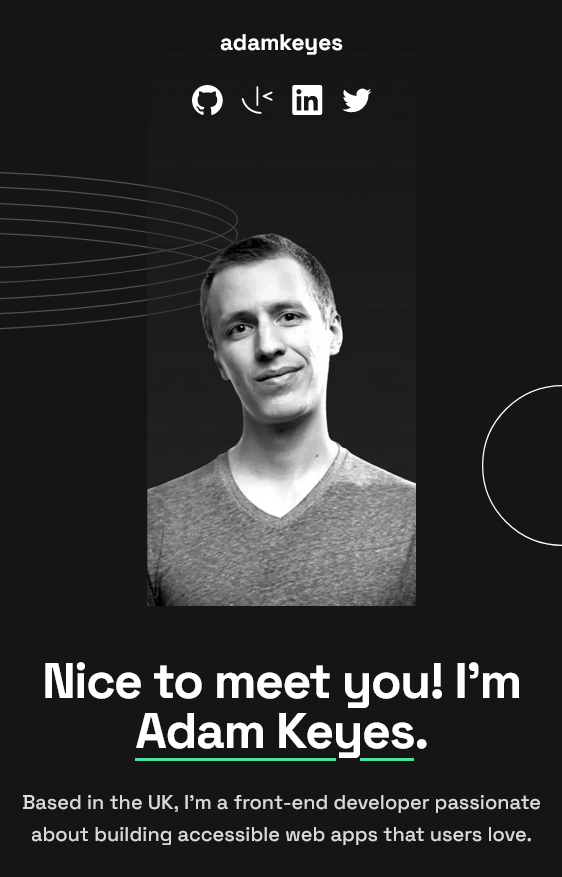

# Frontend Mentor - Single-page developer portfolio solution


This is a solution to the [Single-page developer portfolio challenge on Frontend Mentor](https://www.frontendmentor.io/challenges/singlepage-developer-portfolio-bBVj2ZPi-x). Frontend Mentor challenges help you improve your coding skills by building realistic projects.

## Table of contents

- [Frontend Mentor - Single-page developer portfolio solution](#frontend-mentor---single-page-developer-portfolio-solution)
  - [Table of contents](#table-of-contents)
  - [Overview](#overview)
    - [The challenge](#the-challenge)
    - [Screenshot](#screenshot)
    - [Links](#links)
  - [My process](#my-process)
    - [Built with](#built-with)
    - [What I learned](#what-i-learned)
    - [Continued development](#continued-development)
    - [Useful resources](#useful-resources)
  - [Author](#author)
  - [Acknowledgments](#acknowledgments)

## Overview

### The challenge

Users should be able to:

- Receive an error message when the `form` is submitted if:
  - Any field is empty
  - The email address is not formatted correctly
- View the optimal layout for the interface depending on their device's screen size
- See hover and focus states for all interactive elements on the page
- **Bonus**: Hook the form up so it sends and stores the user's enquiry (you can use a spreadsheet or Airtable to save the enquiries)
- **Bonus**: Add your own details (image, skills, projects) to replace the ones in the design

### Screenshot






### Links

- Solution URL: [GitHub](https://github.com/newbpydev/sp-dev-portfolio-vite-ts-tw)
- Live Site URL: [Netlify](https://master--velvety-gingersnap-b1ba44.netlify.app/)

## My process

### Built with

- Typescript
- Flexbox
- CSS Grid
- Mobile-first workflow
- [React](https://reactjs.org/) - JS library
- [Vite](https://vitejs.dev/) - Frontend Tooling
- [Tailwind](https://tailwindcss.com/) - For styles

### What I learned

In this challenge I decided to use React with Typescript using Vite and Tailwind
as the styling. This is my first try with Tailwind so I decided to take my time
exploring the framework.

```html
<section
  id="contact"
  className="relative pb-10 md:pb-[30px] lg:pb-[47px] space-y-12 text-center section-container bg-dark-gray pt-[60px] lg:pt-[84px] contact-bg-image"
>
  <div
    className="border-b-[1px] pb-24 flex flex-col md:items-center md:pb-[95px] lg:flex-row lg:justify-between lg:items-start "
  >
    <div
      className="flex flex-col space-y-5  mb-[50px] md:mb-[48px] md:w-[445px] lg:text-left lg:space-y-9"
    >
      <h2
        className="text-[40px] font-bold leading-10 tracking-[-1.14px] md:text-h1md md:leading-[72px] lg:text-xl "
      >
        Contact
      </h2>

      <p className="text-[16px] leading-[26px] text-light-gray md:text-base">
        I would love to hear about your project and how I could help. Please
        fill in the form, and I&apos;ll get back to you as soon as possible.
      </p>
    </div>

    <ContactForm />
  </div>
</section>
```

```css
@layer base {
  body {
    @apply text-base text-white font-SpaceGrotesk bg-very-black;
  }
}
```

```js
// Tailwind config
  extend: {
      screens: {
        "2xl": "1440px",
      },
      colors: {
        "very-black": "#151515",
        "dark-gray": "#242424",
        green: "#4EE1A0",
        "light-gray": "#d9d9d9",
        red: "#ff6f5b",
      },
      fontFamily: {
        SpaceGrotesk: ["Space Grotesk", "sans-serif"],
      },
      // fontSize: {},
    },
```

### Continued development

The main focus of this challenge for me was to be able to use Tailwind CSS so I
could master the framework. I will continue to explore the framework further on
the challenges to come. I have noticed that even though it creates the classes
much longer, it is a great framework to work with. I noticed that I used many
hard coded values, ex: `pb-[34px]` which is not the ideal way to work with
Tailwind, so I will need to explore the configuration file and learn how to fine
tune my Tailwind CSS.

### Useful resources

- [TailwindCSS - Adding Custom
  Styles](https://tailwindcss.com/docs/adding-custom-styles) - This guide covers
  topics like customizing your design tokens, how to break out of those
  constraints when necessary, adding your own custom CSS, and extending the
  framework with plugins.

## Author

- Website - [Juan Gomez](https://github.com/newbpydev)
- Frontend Mentor - [@newbpydev](https://www.frontendmentor.io/profile/newbpydev)
- Twitter - [@Newb_PyDev](https://twitter.com/Newb_PyDev)

## Acknowledgments

The code may not be perfect compared to my sensei @jonasschmedtman but I need to
thank him because he has shown me the ropes and now I am a confident web
designer. I will also have to give thanks to Brad Traversy that helped me get a
better understanding of Tailwind CSS, he is a great tutor to follow.
